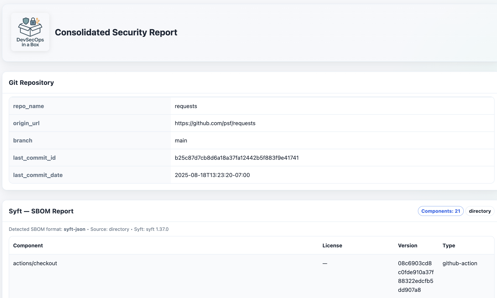
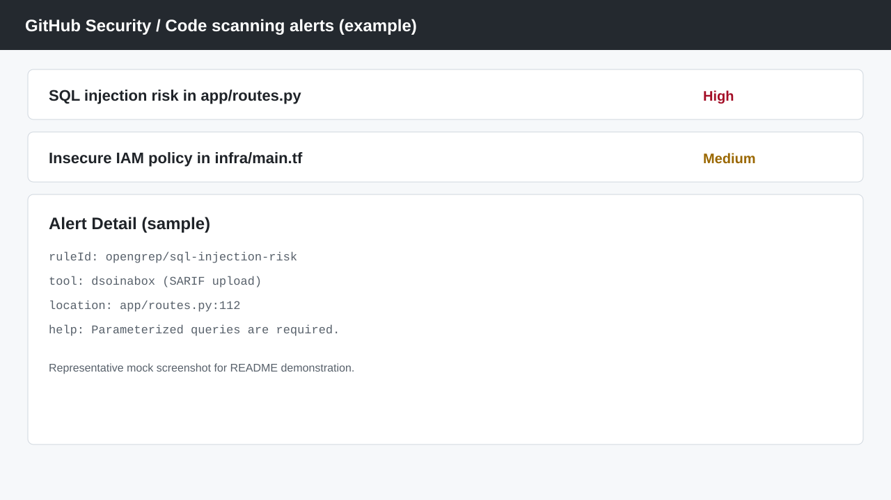

# dsoinabox

Run best-of-breed OSS AppSec scanners through one container.

- Get one normalized output and one policy contract
- Use one waiver file instead of five
- Drop it into any CI with minimal CI-specific logic

Use the best tool for each job, without inheriting five incompatible workflows.

## Demo

Run one command:

```bash
docker run --rm \
  -v $(pwd):/scan_target \
  -v $(pwd)/reports:/reports \
  appsecthings/dsoinabox:latest \
  -t all \
  -o html,sarif \
  --failure_threshold high \
  --fail_on_secrets \
  --show_findings false
```

Output:

```text
[dsoinabox] tools: trufflehog, opengrep, syft, grype, checkov
[dsoinabox] findings: critical=0 high=1 medium=4 low=9 info=12
[dsoinabox] waived: 3 (from .dsoinabox_waivers.yaml)
[dsoinabox] reports:
  - reports/dsoinabox_unified_report_<timestamp>.html
  - reports/dsoinabox_unified_report_<timestamp>.sarif
[dsoinabox] policy: failure_threshold=high fail_on_secrets=true
[dsoinabox] exit_code=1
```

HTML report example:



SARIF result in GitHub Code Scanning example:



Example waiver file (`.dsoinabox_waivers.yaml`):

```yaml
schema_version: "1.0"
finding_waivers:
  - fingerprint: "og:1:RULE:sql-injection-risk:abc123"
    type: "false_positive"
    reason: "Validated safe by parameterization in wrapper layer"
    created_by: "security@example.com"
    created_at: "2026-03-28"
```

Example CI job (GitHub Actions):

```yaml
name: AppSec Scan
on: [pull_request]
jobs:
  dsoinabox:
    runs-on: ubuntu-latest
    steps:
      - uses: actions/checkout@v4
      - name: Run dsoinabox
        run: |
          mkdir -p reports
          docker run --rm \
            -v "$PWD:/scan_target" \
            -v "$PWD/reports:/reports" \
            appsecthings/dsoinabox:latest \
            -t all -o sarif,html --failure_threshold high --fail_on_secrets --show_findings false
          cp "$(ls -1 reports/*.sarif | head -n 1)" reports/dsoinabox.sarif
      - name: Upload SARIF to GitHub
        uses: github/codeql-action/upload-sarif@v3
        with:
          sarif_file: reports/dsoinabox.sarif
```

## What It Runs

`dsoinabox` orchestrates:

- `TruffleHog` (secrets)
- `OpenGrep` (SAST)
- `Syft` (SBOM)
- `Grype` (SCA)
- `Checkov` (IaC)

## Quick Start (Docker)

```bash
docker run --rm \
  -v /path/to/your/code:/scan_target \
  -v /path/to/reports:/reports \
  appsecthings/dsoinabox:latest \
  --show_findings false \
  -t all \
  -o sarif,html,ndjson \
  --tool_output
```

Apple Silicon (M1/M2/M3):

```bash
docker run --rm --platform linux/amd64 \
  -v /path/to/your/code:/scan_target \
  -v /path/to/reports:/reports \
  appsecthings/dsoinabox:latest \
  --show_findings false \
  -t all \
  -o html
```

## Typical CI Gate

```bash
docker run --rm \
  -v $(pwd):/scan_target \
  -v $(pwd)/reports:/reports \
  appsecthings/dsoinabox:latest \
  --show_findings false \
  -t all \
  -o sarif \
  --failure_threshold high \
  --fail_on_secrets
```

Exit codes:

- `0`: success, no threshold violations
- `1`: scan failure or policy threshold exceeded

## Docs

- [Documentation Index](docs/README.md)
- [Getting Started](docs/getting-started/README.md)
- [CLI and Policy Reference](docs/cli/README.md)
- [Runtime Config (`.dsoinabox.yaml`)](docs/config/README.md)
- [Waivers (`.dsoinabox_waivers.yaml`)](docs/waivers/README.md)
- [Output Formats and Report Layout](docs/output/README.md)
- [CI Examples (GitHub Actions, GitLab CI, Jenkins, Azure DevOps)](docs/ci/README.md)
- [Usage Examples](docs/examples/README.md)
- [Architecture Notes](docs/architecture/README.md)
